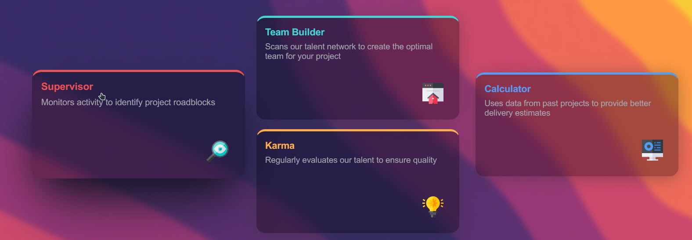

# Frontend Mentor - Four card feature section solution

This is a solution to the
[Four card feature section challenge on Frontend Mentor](https://www.frontendmentor.io/challenges/four-card-feature-section-weK1eFYK).
Frontend Mentor challenges help you improve your coding skills by building
realistic projects.

## Table of contents

- [Overview](#overview)

  - [The challenge](#the-challenge)

- [My process](#my-process)
  - [Built with](#built-with)
  - [What I learned](#what-i-learned)
  - [Useful resources](#useful-resources)

## Overview

### The challenge

Users should be able to:

- View the optimal layout for the site depending on their device's screen size


### Solution

#### Desktop View


#### Mobile View


#### Hover effect




## My process

### Built with

- Semantic HTML5 markup
- CSS custom properties
- background image
- background blur
- glass like effects on card
- Flexbox
- CSS Grid
- Mobile-first workflow

### What I learned

```css
body {
  height: 100vh;
  background-image: url(/blob-scene-haikei.jpeg);
  background-size: cover;
  background-repeat: repeat;
  background-attachment: fixed;
  backdrop-filter: blur(5px);
}
.box:hover {
  box-shadow: #1b1b3145 0 50px 100px -20px, #00000047 0 30px 60px -30px;
  cursor: pointer;
  transition: box-shadow 300ms cubic-bezier(0.25, 0.46, 0.45, 0.94);
  transform: scale(1.05);
  transition: transform 300ms cubic-bezier(0.25, 0.46, 0.45, 0.94);
}
.box {
  background: #00000028;
  border-radius: 16px;
  box-shadow: 0 4px 30px #2d2d2d5f;
  backdrop-filter: blur(8.9px);
  -webkit-backdrop-filter: blur(8.9px);
  border: 1px solid #00000003;
}
```

### Useful resources

- [SVG background](https://haikei.app/) - This helped to create a background
  with patterns, it also has blob maker.
- [To create a gradient](https://cssgradient.io/) - I used this to try out some
  different gradients for design
- [Glass effect](https://css.glass) - This was a great tool to create a glass
  effect on a card
- Image used on mobile is from
  [unsplash](https://unsplash.com/photos/1LirzgcpY2c)
